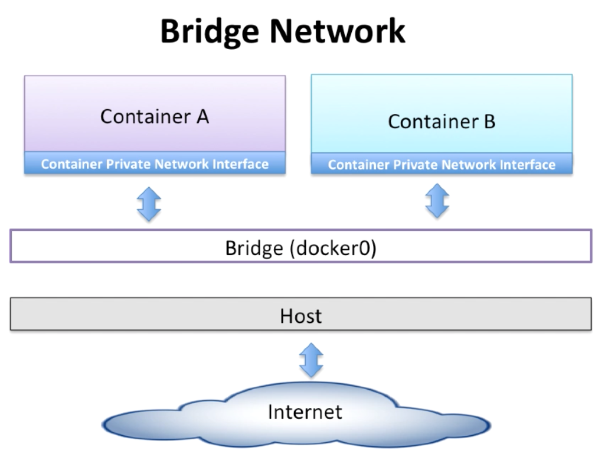

## To build App using Docker - 4
```
OS : macOS Sierra 10.12.5
Docker version : Docker version 17.06.0-ce, build 02c1d87
```

### Networking
[Docks Docker](https://docs.docker.com/engine/userguide/networking/)

#### 1. None Network
- privides the maximum level of network protection.
- Not a good choice if network or internet connection is required.
- Suites Well where the container require the maximum level of network security and network access is not necessary.

##### 1-1. Default network
```
$ docker run -d --net none busybox sleep 1000
=> Generated [Container-ID]

$ docker exec -it [Container-ID] /bin/ash

$ ping 8.8.8.8

$ ifconfig
```

#### 2. Bridge Network

- In a bridge network, containers have access to two network interfaces.
	- A loopback interface
	- A private interface
- All containers in the same bridge network can communicate with each other.
- Containers from different bridge networks can't connect with each other by default.
- Reduces the level of network isolation in favor of better outside connectivity.
- Most suitable where you want to set up a relatively small network on a single host.


##### 2-1. Default network
```
$ docker network ls

$ docker network inspect bridge

$ docker run -d --name container_1 busybox sleep 1000
=> inet addr:172.17.0.2

$ docker exec -it container_1 ifconfig

$ docker run -d --name container_2 busybox sleep 1000

$ docker exec -it container_2 ifconfig
=> inet addr:172.17.0.3

$ docker exec -it container_1 ping 172.17.0.3

$ docker exec -it container_1 ping 8.8.8.8
```

##### 2-2. Creation network
```
$ docker network create --driver bridge my_bridge_network
=> inet addr:172.18.0.1

$ docker network ls

$ docker network inspect my_bridge_network


- Difference
	1. IP range of the default bridge network : 172.17.0.0. ~ 172.17.255.255
	2. IP range of the my_bridge_network : 172.18.0.0. ~ 172.18.255.255


$ docker run -d --name container_3 --net my_bridge_network busybox sleep 1000
=> inet addr:172.18.0.2

$ docker exec -it container_3 ifconfig

$ docker network inspect my_bridge_network

$ docker exec -it container_3 ping 172.17.0.2
```

##### 2-3. Connection test each other bridge
```
$ docker network connect bridge container_3

$ docker exec -it container_3 ifconfig

$ docker exec -it container_3 ping 172.17.0.3

$ docker network disconnect bridge container_3

$ docker exec -it container_3 ifconfig
```